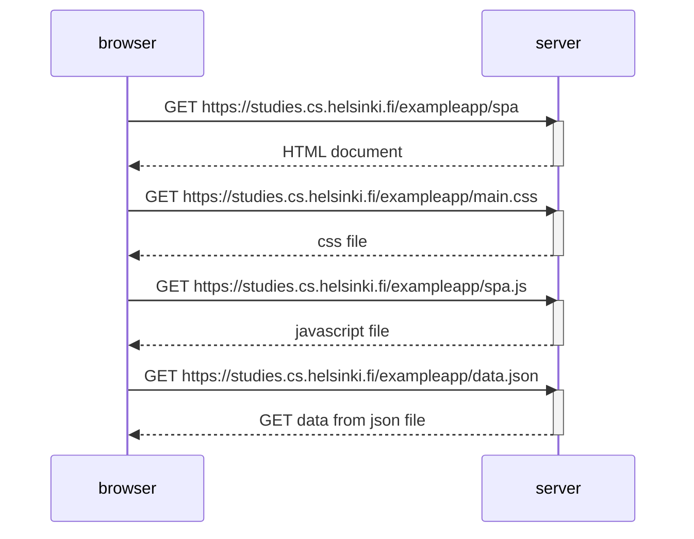
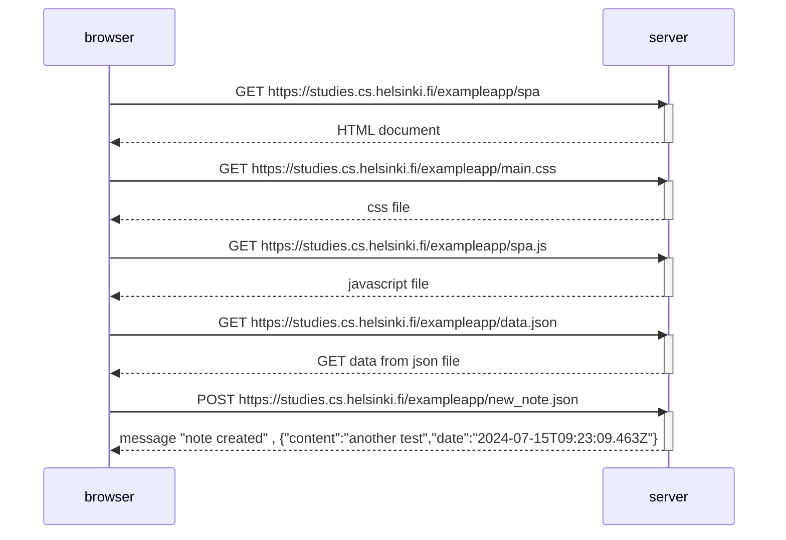

# note diagram :

####  0.4
```mermaid
sequenceDiagram
    participant browser
    participant server

    browser ->> server : GET https://studies.cs.helsinki.fi/exampleapp/notes
    activate server
    server -->> browser : HTML document
    deactivate server

    browser ->> server : GET https://studies.cs.helsinki.fi/exampleapp/main.css
    activate server
    server -->> browser : css file
    deactivate server

    browser ->> server : GET https://studies.cs.helsinki.fi/exampleapp/main.js
    activate server
    server -->> browser : javascript file
    deactivate server

    browser ->> server : GET https://studies.cs.helsinki.fi/exampleapp/data.json
    activate server
    server -->> browser : GET data from json file
    deactivate server

    browser ->> server : POST https://studies.cs.helsinki.fi/exampleapp/new_note.html
    activate server
    server -->> browser : POST "test101" 
    deactivate server    

    browser ->> server : GET https://studies.cs.helsinki.fi/exampleapp/data.json
    activate server
    server -->> browser : GET data from json file (including the last added by me : 
        {
        "content": "test101",
        "date": "2024-07-15T08:55:05.260Z"
        })
    deactivate server
```

    
Note right of browser: The browser starts executing the JavaScript code that fetches the JSON from the server.


### 0.5


### 0.6

